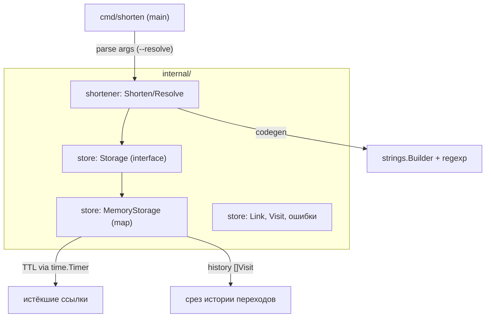

# Техническое задание. Глава 1: Введение в Go

## 1. Цели и границы

### 1.1. Цель
Закрепить теорию Главы 1 («Введение в Go») из [docs/topics.md](../../topics.md) через построение работающего проекта — CLI-утилиты `shorten`, сокращающей длинные URL в короткие коды и восстанавливающей оригинальный URL по коду. Проект развивается по главам; данное ТЗ описывает только результат Главы 1.

### 1.2. Деливерабл
Консольная утилита `shorten` с хранилищем маппингов `code → url` в памяти процесса:

```bash
shorten https://example.com
# => https://s.io/AbC12x

shorten --resolve AbC12x
# => https://example.com
```

### 1.3. Границы Главы 1
- Хранилище — только в памяти (`map`); персистентность появится в Главе 3.
- Сетевого взаимодействия нет; HTTP-сервер появится в Главе 4.
- Конкурентности нет (однопоточное использование); горутины/мьютексы — Глава 2.
- Тестирование — минимальное (smoke-проверка запуска); полное покрытие — Глава 5.

## 2. Связь тем Главы 1 с проектом

| Тема | Применение в проекте |
|---|---|
| 1.1–1.3 | Структура пакета `cmd/shorten`, `go build`, `gofmt`, `go vet`, именование, doc comments |
| 1.2 | Парсинг аргументов, функции `Shorten(longURL)`, `Resolve(code)` |
| 1.4 | Срез для истории переходов, `append` |
| 1.5 | Генерация кода через `strings.Builder`, валидация URL через `regexp` |
| 1.6 | `map[string]*Link` — хранилище маппингов |
| 1.7 | TTL ссылок через `time.Timer` / `time.Duration` |
| 1.8 | `struct Link { Code, LongURL, CreatedAt, TTL }`, методы `String()` |
| 1.9 | Интерфейс `Storage` (memory impl) — accept interfaces, return structs |
| 1.10 | Кастомные ошибки `ErrNotFound`, `ErrExpired`; `defer` для закрытия файла |
| 1.11 | Разбивка на пакеты `internal/store`, `internal/shortener`, `go.mod` |
| 1.12 | Дженерик-функция `Filter[T](items []T, pred func(T) bool)` |
| 1.13 | Итератор `All()` поверх хранилища через `range-over-func` |

## 3. Архитектура



### 3.1. Структура пакетов
```
url-shortener/
  go.mod
  cmd/
    shorten/
      main.go              # точка входа, парсинг os.Args/flag
  internal/
    shortener/
      shortener.go         # Shorten(longURL) (string, error), Resolve(code) (string, error)
      codegen.go           # генерация короткого кода (strings.Builder)
      validate.go          # валидация URL (regexp)
      filter.go            # дженерик Filter[T]
    store/
      store.go             # интерфейс Storage
      memory.go            # MemoryStorage (map[string]*Link)
      link.go              # тип Link, Visit, ошибки ErrNotFound, ErrExpired
      iter.go              # итератор All() (range-over-func)
  docs/
    ...
```

### 3.2. Зависимости направлений
`cmd/shorten` → `internal/shortener` → `internal/store`. Внутренние пакеты не импортируют `cmd/*`. `shortener` зависит от интерфейса `Storage`, а не от конкретной реализации (accept interfaces, return structs).

## 4. Требования к функционалу

### 4.1. Команды CLI
- `shorten <longURL>` — создать короткий код для `longURL`, напечатать `https://s.io/<code>`.
- `shorten --resolve <code>` — напечатать оригинальный URL.
- `shorten --help` / `shorten -h` — краткая справка по командам.

### 4.2. Форматы вывода
- Успешное сокращение: единственная строка `https://s.io/<code>` + `\n`.
- Успешный resolve: единственная строка с оригинальным URL + `\n`.
- Ошибка: строка вида `error: <сообщение>` в stderr, код возврата ≠ 0.

### 4.3. Поведение при ошибках
- Некорректный URL (не проходит `regexp`-валидацию) → `error: invalid URL`.
- Неизвестный код при `--resolve` → `error: not found` (обёртка `ErrNotFound`).
- Истёкшая ссылка при `--resolve` → `error: link expired` (обёртка `ErrExpired`).
- Повторное сокращение того же URL — опционально: возвращать существующий код (см. задачу 05).

### 4.4. Параметры по умолчанию
- Длина короткого кода: 6 символов из алфавита `[A-Za-z0-9]`.
- Префикс короткой ссылки: `https://s.io/`.
- TTL по умолчанию: 24 часа (настраивается константой `DefaultTTL`).

## 5. Требования к коду

- Код форматируется `gofmt` и проходит `go vet` без замечаний.
- Именование по Effective Go: `MixedCaps` для идентификаторов, пакеты — короткие, в нижнем регистре, без `snake_case`.
- Все экспортируемые функции, типы и константы снабжены doc comments (godoc), начинающимися с имени определяемого идентификатора.
- Комментарии в коде — на русском языке; имена идентификаторов — на английском.
- Принцип `accept interfaces, return structs`: публичные конструкторы возвращают конкретные типы, публичные методы принимают интерфейсы там, где это уместно.
- Минимум зависимостей: только стандартная библиотека Go (внешние модули в Главе 1 не требуются).

## 6. Модель данных

### 6.1. Тип `Link`
```go
type Link struct {
    Code      string
    LongURL   string
    CreatedAt time.Time
    TTL       time.Duration
}
```
Методы:
- `String() string` — человекочитаемое представление (для отладки/логов).
- `IsExpired(at time.Time) bool` — проверка истечения TTL.

### 6.2. Тип `Visit`
```go
type Visit struct {
    Code      string
    VisitedAt time.Time
}
```
Используется в срезе истории переходов `[]Visit` (тема 1.4).

## 7. Интерфейс `Storage`

```go
type Storage interface {
    // Save сохраняет ссылку. Возвращает ErrDuplicate, если код уже занят.
    Save(ctx context.Context, link *Link) error
    // Resolve возвращает Link по коду. Ошибки: ErrNotFound, ErrExpired.
    Resolve(ctx context.Context, code string) (*Link, error)
    // Delete удаляет ссылку по коду. Idempotent.
    Delete(ctx context.Context, code string) error
    // All возвращает итератор по всем ссылкам (range-over-func, тема 1.13).
    All() iter.Seq2[*Link, error]
}
```

`context.Context` вводится сигнатурно для совместимости с будущими главами; в Главе 1 он не используется для отмены (контекст — Глава 2.6).

## 8. Ошибки

- `ErrNotFound` — sentinel-ошибка: код не найден.
- `ErrExpired` — sentinel-ошибка: TTL истёк.
- `ErrDuplicate` — sentinel-ошибка: код уже существует (тема 1.10.2).
- Обёртка через `fmt.Errorf("...: %w", err)` (тема 1.10.3).
- Проверка через `errors.Is` / `errors.As`; агрегация через `errors.Join`.
- `panic`/`recover` — не используются в штатной логике; только демонстрационный пример в задаче 09.

## 9. Критерии приёмки Главы 1

- [ ] `go build ./...` проходит без ошибок.
- [ ] `go vet ./...` без замечаний.
- [ ] `gofmt -l .` возвращает пустой список файлов.
- [ ] `shorten https://example.com` печатает валидный короткий URL.
- [ ] `shorten --resolve <code>` печатает `https://example.com`.
- [ ] `shorten --resolve unknown` печатает `error: not found` и возвращает ненулевой код.
- [ ] Истёкшая по TTL ссылка возвращает `error: link expired`.
- [ ] Все экспортируемые идентификаторы задокументированы (godoc).
- [ ] Пакеты организованы согласно разделу 3.1.
- [ ] Реализованы дженерик `Filter[T]` и итератор `All()`.

## 10. Карта задач

| № | Файл | Темы | Оценка |
|---|---|---|---|
| 01 | [01-project-setup.md](01-project-setup.md) | 1.1, 1.3, 1.11 | ~6ч |
| 02 | [02-syntax-functions.md](02-syntax-functions.md) | 1.2 | ~8ч |
| 03 | [03-slices-history.md](03-slices-history.md) | 1.4 | ~6ч |
| 04 | [04-strings-codegen.md](04-strings-codegen.md) | 1.5 | ~8ч |
| 05 | [05-maps-storage.md](05-maps-storage.md) | 1.6 | ~5ч |
| 06 | [06-time-ttl.md](06-time-ttl.md) | 1.7 | ~6ч |
| 07 | [07-structs-methods.md](07-structs-methods.md) | 1.8 | ~8ч |
| 08 | [08-interfaces-storage.md](08-interfaces-storage.md) | 1.9 | ~7ч |
| 09 | [09-errors-defer.md](09-errors-defer.md) | 1.10 | ~7ч |
| 10 | [10-generics-filter.md](10-generics-filter.md) | 1.12 | ~5ч |
| 11 | [11-iterators.md](11-iterators.md) | 1.13 | ~5ч |

Задачи выполняются последовательно по номеру; каждая опирается на результат предыдущих.
