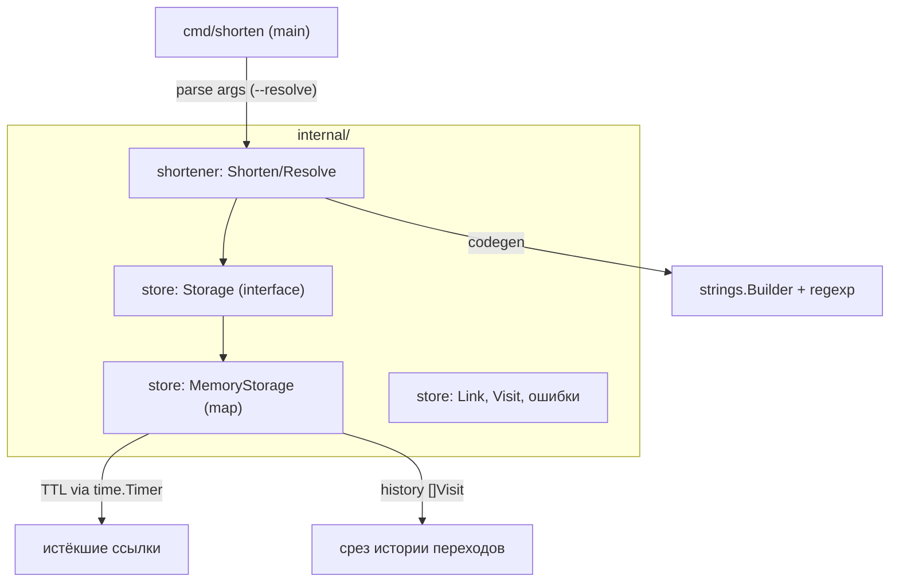

# Техническое задание. Глава 1: Введение в Go

## 1. Цели и границы

### 1.1. Цель
Закрепить теорию Главы 1 («Введение в Go») из [docs/topics.md](../../topics.md) через построение работающего проекта — CLI-утилиты `shorten`, сокращающей длинные URL в короткие коды и восстанавливающей оригинальный URL по коду. Проект развивается по главам; данное ТЗ описывает только результат Главы 1.

### 1.2. Деливерабл
Консольная утилита `shorten` с хранилищем маппингов `code → url` в памяти процесса:

```bash
shorten https://example.com
# => https://s.io/AbC12x

shorten --resolve AbC12x
# => https://example.com
```

### 1.3. Границы Главы 1
- Хранилище — только в памяти (`map`); персистентность появится в Главе 3.
- Сетевого взаимодействия нет; HTTP-сервер появится в Главе 4.
- Конкурентности нет (однопоточное использование); горутины/мьютексы — Глава 2.
- Тестирование — минимальное (smoke-проверка запуска); полное покрытие — Глава 5.

## 2. Связь тем Главы 1 с проектом

| Тема | Применение в проекте |
|---|---|
| 1.1–1.3 | Структура пакета `cmd/shorten`, `go build`, `gofmt`, `go vet`, именование, doc comments |
| 1.2 | Парсинг аргументов, функции `Shorten(longURL)`, `Resolve(code)` |
| 1.4 | Срез для истории переходов, `append` |
| 1.5 | Генерация кода через `strings.Builder`, валидация URL через `regexp` |
| 1.6 | `map[string]*Link` — хранилище маппингов |
| 1.7 | TTL ссылок через `time.Timer` / `time.Duration` |
| 1.8 | `struct Link` (с встроенным `Audit`), `Visit`, методы `String()`/`IsExpired()`/`IncHits()`/`Touch()` |
| 1.9 | Интерфейс `Storage` (memory impl) — accept interfaces, return structs |
| 1.10 | Кастомные ошибки `ErrNotFound`, `ErrExpired`, `ErrDuplicate`, `ErrInvalidURL`; `defer` для закрытия файла |
| 1.11 | Разбивка на пакеты `internal/store`, `internal/shortener`, `go.mod` |
| 1.12 | Дженерик-функция `Filter[T](items []T, pred func(T) bool)` |
| 1.13 | Итератор `All()` поверх хранилища через `range-over-func` |

## 3. Архитектура



### 3.1. Структура пакетов
```
url-shortener/
  go.mod
  cmd/
    shorten/
      main.go              # точка входа, парсинг os.Args/flag
  internal/
    shortener/
      shortener.go         # тип Shortener с методами Shorten/Resolve (задача 05+)
      codegen.go           # генерация короткого кода (strings.Builder)
      validate.go          # валидация URL (regexp)
    store/
      store.go             # интерфейс Storage
      memory.go            # MemoryStorage (map[string]*Link)
      link.go              # тип Link, Visit, Audit
      errors.go            # sentinel-ошибки ErrNotFound, ErrExpired, ErrDuplicate, тип LinkError
      iter.go              # итератор All() (range-over-func)
    xslices/
      xslices.go           # обобщённые утилиты Filter/Map/Reduce (вынесено из shortener, чтобы избежать цикла импортов)
  docs/
    ...
```

### 3.2. Зависимости направлений
`cmd/shorten` → `internal/shortener` → `internal/store`; `internal/shortener` и `internal/store` → `internal/xslices` (нейтральный пакет с обобщёнными утилитами, чтобы избежать цикла импортов). Внутренние пакеты не импортируют `cmd/*`. `shortener` зависит от интерфейса `Storage`, а не от конкретной реализации (accept interfaces, return structs).

## 4. Требования к функционалу

### 4.1. Команды CLI
- `shorten <longURL>` — создать короткий код для `longURL`, напечатать `https://s.io/<code>`.
- `shorten --resolve <code>` — напечатать оригинальный URL.
- `shorten --help` / `shorten -h` — краткая справка по командам.

### 4.2. Форматы вывода
- Успешное сокращение: единственная строка `https://s.io/<code>` + `\n`.
- Успешный resolve: единственная строка с оригинальным URL + `\n`.
- Ошибка: строка вида `error: <сообщение>` в stderr, код возврата ≠ 0.

### 4.3. Поведение при ошибках
- Некорректный URL (не проходит `regexp`-валидацию) → `error: invalid URL`.
- Неизвестный код при `--resolve` → `error: not found` (обёртка `ErrNotFound`).
- Истёкшая ссылка при `--resolve` → `error: link expired` (обёртка `ErrExpired`).
- Повторное сокращение того же URL — опционально: возвращать существующий код (см. задачу 05).

### 4.4. Параметры по умолчанию
- Длина короткого кода: 6 символов из алфавита `[A-Za-z0-9]`.
- Префикс короткой ссылки: `https://s.io/`.
- TTL по умолчанию: 24 часа (настраивается константой `DefaultTTL`).

## 5. Требования к коду

- Код форматируется `gofmt` и проходит `go vet` без замечаний.
- Именование по Effective Go: `MixedCaps` для идентификаторов, пакеты — короткие, в нижнем регистре, без `snake_case`.
- Все экспортируемые функции, типы и константы снабжены doc comments (godoc), начинающимися с имени определяемого идентификатора.
- Комментарии в коде — на русском языке; имена идентификаторов — на английском.
- Принцип `accept interfaces, return structs`: публичные конструкторы возвращают конкретные типы, публичные методы принимают интерфейсы там, где это уместно.
- Минимум зависимостей: только стандартная библиотека Go (внешние модули в Главе 1 не требуются).

## 6. Модель данных

### 6.1. Тип `Link`
```go
// Audit хранит служебные метаданные создания/изменения.
type Audit struct {
    CreatedAt time.Time
    UpdatedAt time.Time
}

// Link описывает сокращённую ссылку и её метаданные.
type Link struct {
    Code    string
    LongURL string `json:"long_url"`
    TTL     time.Duration
    Hits    int64 // счётчик переходов
    Audit        // встраивание — поля Audit промоутятся (тема 1.8.3)
}
```
Методы:
- `String() string` — человекочитаемое представление (для отладки/логов).
- `IsExpired(at time.Time) bool` — проверка истечения TTL.
- `IncHits()` — увеличивает счётчик переходов (pointer-receiver, мутирует).
- `Touch()` — обновляет `Audit.UpdatedAt` (через встроенный `Audit`).

### 6.2. Тип `Visit`
```go
type Visit struct {
    Code      string
    VisitedAt time.Time
}
```
Используется в срезе истории переходов `[]Visit` (тема 1.4).

## 7. Интерфейс `Storage`

```go
type Storage interface {
    // Save сохраняет ссылку. Возвращает ErrDuplicate, если код уже занят.
    Save(link *Link) error
    // Resolve возвращает Link по коду. Ошибки: ErrNotFound, ErrExpired.
    Resolve(code string) (*Link, error)
    // Delete удаляет ссылку по коду. Idempotent.
    Delete(code string) error
    // All возвращает итератор по всем ссылкам (range-over-func, тема 1.13).
    All() iter.Seq2[*Link, error]
}
```

`context.Context` не используется в Главе 1; он появится в сигнатурах методов начиная с Главы 2.6 (контекст и отмены).

## 8. Ошибки

- `ErrNotFound` — sentinel-ошибка: код не найден.
- `ErrExpired` — sentinel-ошибка: TTL истёк.
- `ErrDuplicate` — sentinel-ошибка: код уже существует (тема 1.10.2).
- Обёртка через `fmt.Errorf("...: %w", err)` (тема 1.10.3).
- Проверка через `errors.Is` / `errors.As`; агрегация через `errors.Join`.
- `panic`/`recover` — не используются в штатной логике; только демонстрационный пример в задаче 09.

## 9. Критерии приёмки Главы 1

- [ ] `go build ./...` проходит без ошибок.
- [ ] `go vet ./...` без замечаний.
- [ ] `gofmt -l .` возвращает пустой список файлов.
- [ ] `shorten https://example.com` печатает валидный короткий URL вида `https://s.io/<code>`.
- [ ] `shorten --resolve <code>` печатает `https://example.com` (данные берутся из `MemoryStorage`, а не из глобальной `map`).
- [ ] `shorten --resolve unknown` печатает `error: not found` и возвращает ненулевой код.
- [ ] `shorten ftp://example.com` (невалидный URL) печатает `error: invalid URL` и возвращает ненулевой код.
- [ ] `shorten --help` и `shorten -h` печатают краткую справку и возвращают нулевой код.
- [ ] Истёкшая по TTL ссылка возвращает `error: link expired`.
- [ ] Все экспортируемые идентификаторы задокументированы (godoc).
- [ ] Пакеты организованы согласно разделу 3.1.
- [ ] Реализованы дженерик `Filter[T]` и итератор `All()`.
- [ ] Финальный smoke-сценарий (один процесс): сократить URL → получить код → разрешить код → получить исходный URL.

## 9.1. Финальная сборка приложения
После вехи M5 приложение должно быть полностью работоспособно: `cmd/shorten/main.go` собирает зависимости (`store.NewMemoryStorage` → `shortener.NewShortener`), парсит аргументы, вызывает методы `*Shortener` и выводит результаты/ошибки согласно разделу 4. Веха M6 (дженерики, итераторы) расширяет функциональность хранилища, но не обязательна для базового цикла `shorten`/`resolve`; тем не менее её методы (`Filter`, `All`, `Active`) должны компилироваться и проходить `go vet`.

## 10. Карта вех

Задачи сгруппированы по **вехам приложения**, а не по темам теории: каждая веха — видимый шаг к работающему `shorten`, а темы теории отрабатываются как практика внутри вехи (см. раздел «Отработка тем» в файле вехи). Вехи выполняются последовательно; каждая опирается на результат предыдущих.

### Таблица A — Путь сборки

| Веха | Файл | Результат (видимый прогресс) | Статус |
|---|---|---|---|
| M1 | [m1-skeleton-cli.md](m1-skeleton-cli.md) | `go.mod`, скелет пакетов, CLI с парсингом `--resolve`/URL/`--help`, `Shorten`/`Resolve` на заглушке `map` | базовый цикл (заглушка) |
| M2 | [m2-storage-history.md](m2-storage-history.md) | `MemoryStorage` (`map[string]*Link`), модель `Link`/`Audit`/`Visit`, история `[]Visit`, методы `*Shortener` | хранилище |
| M3 | [m3-codegen-validation.md](m3-codegen-validation.md) | `GenerateCode` (`strings.Builder`), `Validate` (`regexp`), интеграция в `Shorten` | настоящие коды + валидация |
| M4 | [m4-ttl.md](m4-ttl.md) | TTL (`DefaultTTL`), `IsExpired`, ленивая проверка в `Resolve` | срок жизни ссылок |
| M5 | [m5-interfaces-errors.md](m5-interfaces-errors.md) | Интерфейс `Storage`, sentinel-ошибки, `LinkError`, `%w`, маппинг ошибок в `main` | **приложение готово** |
| M6 | [m6-generics-iterators.md](m6-generics-iterators.md) | `xslices.Filter`/`Map`/`Reduce`/`Sum`, `All()`/`Active()` (range-over-func) | расширение хранилища |

### Таблица B — Покрытие тем

Гарантия, что каждая подтема теории (из [docs/topics.md](../../topics.md), глава 1) отрабатывается в какой-то вехе.

| Тема | Веха |
|---|---|
| 1.1.1–1.1.4 (знакомство с Go, окружение, первая программа, инструменты) | M1 |
| 1.2.1–1.2.9 (основы синтаксиса) | M1 |
| 1.3.1–1.3.2 (Effective Go, документирование) | M1 |
| 1.4.1–1.4.4 (массивы и срезы) | M2 |
| 1.5.1–1.5.6 (строки) | M3 |
| 1.6.1–1.6.3 (карты) | M2 |
| 1.7.1–1.7.2 (время) | M4 |
| 1.8.1–1.8.6 (указатели, структуры, методы) | M2 |
| 1.9.1–1.9.7 (интерфейсы) | M5 |
| 1.10.1–1.10.6 (ошибки, panic, defer) | M5 |
| 1.11.1–1.11.2 (пакеты, go-модули) | M1 |
| 1.11.3–1.11.7 (go tool, workspaces, GOPRIVATE, vendoring, SemVer/v2) | вне главы 1 |
| 1.12.1–1.12.4 (дженерики) | M6 |
| 1.13.1–1.13.2 (итераторы) | M6 |
